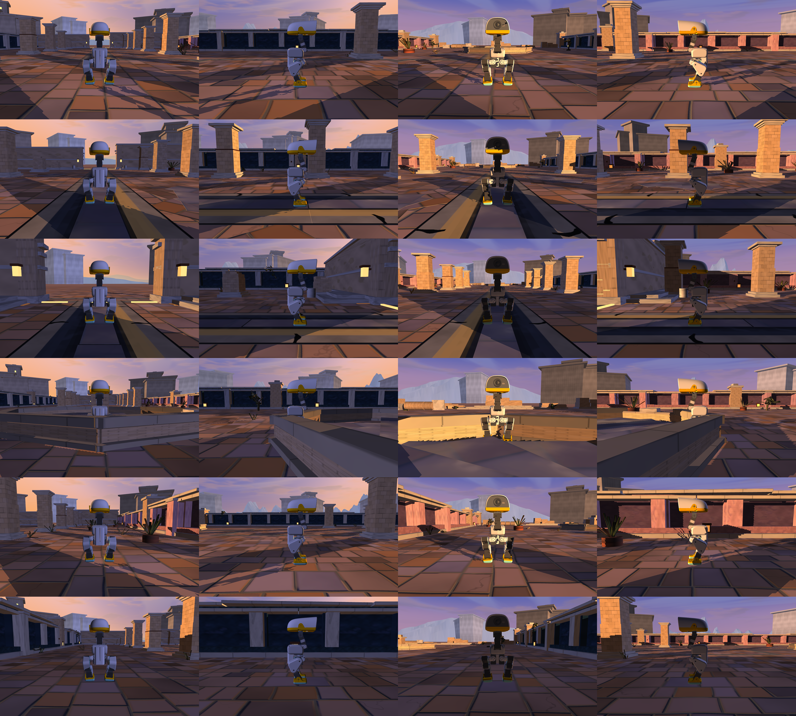
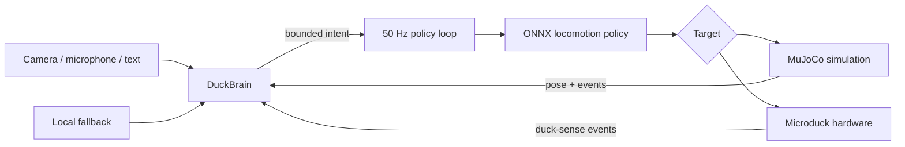

# Microduck AI World

<p align="center">
  
</p>

<p align="center">
  <strong>An embodied-AI playground for Microduck: robot runtime, reinforcement-learning policies, a detailed MuJoCo world, and a vision-language brain that never blocks the control loop.</strong>
</p>

<p align="center">
  <a href="#quickstart">Quickstart</a> &middot;
  <a href="#architecture">Architecture</a> &middot;
  <a href="#repository-layout">Repository layout</a> &middot;
  <a href="#upstream-and-license">License</a>
</p>

---

## What this adds

This repository brings the Microduck runtime and training environment together, then extends them with an experimental embodied-AI layer:

- **Vision-guided autonomy:** a head-mounted camera feeds a vision-language model that returns bounded movement and action intents.
- **Non-blocking control:** network inference runs off the control thread, so model latency becomes stale intent instead of robot lag.
- **Voice and text commands:** push-to-talk or append a command to `say_to_duck.txt`; local speech recognition is preferred when available.
- **Offline fallback:** the duck continues with a local wander policy when the API is missing or unavailable.
- **The Water Court:** a custom MuJoCo environment with architecture, terrain, vegetation, props, lighting, obstacles, and race layouts.
- **Robot-side sensing:** the Rust `duck-sense` daemon provides a path for sensor events and 0G-backed interpretation on the physical robot.

The reinforcement-learning policy still owns balance and locomotion. The AI layer only proposes high-level intent such as forward velocity, turning, searching, sitting, kicking, or picking up an object.

## Architecture



`DuckBrain` runs on a slower asynchronous cadence. The 50 Hz loop reads the most recent validated intent without ever waiting for the network. Unknown actions are rejected before they reach the policy state machine.

## Repository layout

| Path | Purpose |
|---|---|
| [`simulation/`](simulation/) | MuJoCo/mjlab environments, PPO training, policy inference, AI brain, custom scenes, tests, and environment assets |
| [`runtime/`](runtime/) | Rust services deployed on the physical Microduck, ONNX policies, control IPC, sensing, update tooling, and robot documentation |
| [`simulation/scripts/duck_brain.py`](simulation/scripts/duck_brain.py) | Asynchronous vision-language brain, semantic search, voice input, local fallback, and intent validation |
| [`simulation/src/mjlab_microduck/robot/microduck/scene_aaa.xml`](simulation/src/mjlab_microduck/robot/microduck/scene_aaa.xml) | Composed Water Court environment |
| [`runtime/duck-sense/`](runtime/duck-sense/) | Robot-side sensing and 0G integration daemon |

## Quickstart

### Requirements

- Python 3.12
- [`uv`](https://docs.astral.sh/uv/)
- A CUDA-capable GPU for training; policy playback can run on CPU
- `ffmpeg` for microphone input
- Rust stable for the robot runtime

### 1. Install the simulation

```bash
git clone https://github.com/shaibuafeez/microduck-ai-world.git
cd microduck-ai-world/simulation
uv sync
```

### 2. Configure the optional AI brain

The simulation works without an API key. Without one, the duck uses its local fallback behaviour.

```bash
cp .env.example .env
```

Then set `OG_API_KEY` in `.env`. Load the values into your shell before starting the simulation:

```bash
set -a
source .env
set +a
```

### 3. Explore the Water Court

```bash
uv run scripts/infer_policy.py \
  --walking ../runtime/policies/alpha_walking.onnx \
  --scene src/mjlab_microduck/robot/microduck/scene_aaa.xml \
  --brain
```

Add `--speak` for spoken narration or `--blind` to run the brain without camera frames.

To send a text instruction while the simulation is running:

```bash
echo "find the orange ball" >> say_to_duck.txt
```

Press `V` in the viewer for push-to-talk. The control loop remains responsive while transcription and model inference run in background threads.

### 4. Run the race environment

```bash
uv run scripts/infer_policy.py \
  --roller \
  --walking ../runtime/policies/roller.onnx \
  --scene src/mjlab_microduck/robot/microduck/scene_race.xml \
  --brain \
  --race
```

## Training and export

Train a walking policy with PPO:

```bash
cd simulation
uv run train Mjlab-Velocity-Flat-MicroDuck --env.scene.num-envs 4096
```

Export a checkpoint for the Rust runtime:

```bash
uv run scripts/export.py Mjlab-Velocity-Flat-MicroDuck \
  --wandb-run-path <entity/project/run_id>
```

See [`simulation/README.md`](simulation/README.md) for all registered tasks, terrain variants, training guidance, and sim-to-real notes.

## Robot runtime

The physical-robot stack is a Rust workspace of small services communicating through JSON-RPC over Unix sockets. It includes the 50 Hz control loop, Bluetooth and gamepad input, camera streaming, configuration, signed updates, and sensing.

```bash
cd runtime
cargo check -p duck-sense
```

Hardware installation and deployment are documented in [`runtime/docs/`](runtime/docs/) and [`runtime/CONTRIBUTING.md`](runtime/CONTRIBUTING.md). Do not deploy experimental policies to hardware without validating joint limits, action ranges, fall handling, and emergency-stop behaviour.

## Configuration

| Variable | Required | Default | Purpose |
|---|---:|---|---|
| `OG_API_KEY` | No | empty | Enables online brain inference |
| `OG_BASE_URL` | No | `https://router-api.0g.ai/v1` | OpenAI-compatible model endpoint |
| `OG_BRAIN_MODEL` | No | `qwen3-vl-30b` | Vision-language model used by the brain |
| `DUCK_MIC` | No | `:0` | Audio input passed to `ffmpeg` on macOS |

Never commit `.env`, API keys, robot signing keys, private keys, model checkpoints, or raw logs. The repository ignores these by default.

## Validation

```bash
# Simulation tests
cd simulation
uv run python -m pytest tests

# Focused robot-side check
cd ../runtime
cargo check -p duck-sense
```

Simulation validation should happen before hardware testing. Online model output is advisory and constrained, but it is still nondeterministic.

## Upstream and license

This is an experimental derivative of two projects by [Pollen Robotics](https://github.com/pollen-robotics):

- [`pollen-robotics/microduck`](https://github.com/pollen-robotics/microduck), runtime snapshot `590b986bd8c0d50ae02cb3ea2f59c463b6828168`
- [`pollen-robotics/microduck_rl`](https://github.com/pollen-robotics/microduck_rl), simulation snapshot `d424a0c899f6b33cbd3daeb279913134349c0b63`

The upstream projects and this derivative are distributed under the Apache License 2.0. See [`LICENSE`](LICENSE), [`NOTICE`](NOTICE), and the license files retained inside each source directory. Microduck and Pollen Robotics names and marks belong to their respective owners.

